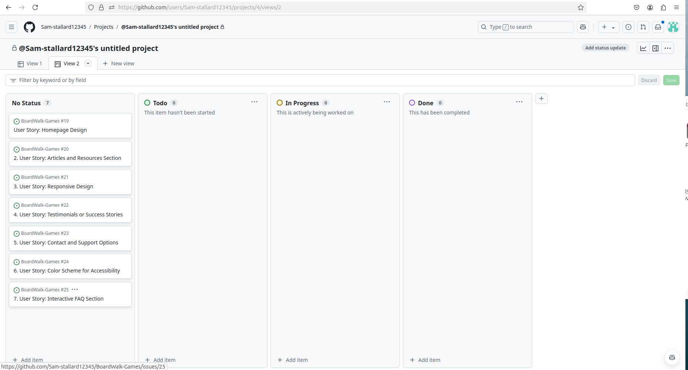

# P1-Mental-Health

<h1>ClearSpace</h1>

This is my first independent project as part of the Code Institute 16 week bookcamp. In this I aim to Design a cohesive one-page layout website with a main navigation menu and structured content using HTML with CSS and Bootstrap.

By providing accessible, beginner-friendly information on mental health and creating a welcoming webpage we can direct users toward our CTA: Sign up.

<h2> Features </h2>

<h3> Homepage Design <h3>
 
<h3> Color Scheme </h3>#

 For the color I chose a calming color palette suitable for mental health (e.g., pastels, blues, and greens).Ensured text met WCAG contrast standards with tools like Contrast Checker and added options for high-contrast themes (optional advanced feature).

Used Iconify to generate the icon

<h3> Hero Image and Tagline </h3>

<h3> Articles and Resources Section<h3>

<h3> Testimonials <h3>

<h3> Sign up Page <h3>

<h3> Thank You Page <h3>

<h2>Instances of AI Use:</h2>
<li>ChatGPT for User Stories, Acceptance Criteria and Task List</li>

<li>Copilot for Image Generation</li>